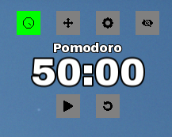

# Pomodoro

A lightweight, always-on-top desktop Pomodoro timer built with C++ and SFML, featuring a transparent, borderless, click-through overlay window.

## Table of Contents
- [Overview](#overview)
- [TechStack](#techstack)
- [Features](#features)
- [Download](#download)
- [Attributions](#attributions)

## Overview
Pomodoro is a minimal desktop widget that sits on top of your other windows and helps you run work/break cycles using the Pomodoro technique. It's built as a frameless, transparent overlay that only intercepts mouse clicks over its own UI, so it stays out of your way otherwise. It includes a Timer screen for running the countdown and a Settings screen for configuring work/break durations, autostart behavior, and alert volume.

  

## TechStack

  

## Features
- **Countdown Timer**: Tracks work and break sessions down to the second, using a real-time accumulator so it stays accurate even when the app is idle in the background.
- **Work/Break Cycling**: Automatically switches between work and break phases when the countdown reaches zero.
- **Configurable Settings**: Adjustable work duration, break duration, autostart toggles for each phase, and an audio volume slider.
- **Audio Alerts**: Plays a sound when a session ends, respecting the configured volume.
- **Transparent Overlay Window**: Frameless, always-on-top, click-through window that only captures input over its own buttons and controls.
- **Draggable UI**: Move the widget anywhere on screen via a dedicated move handle.
- **Hide Toggle**: Collapse the widget down to a minimal state when you don't need the full UI visible.

## Download
Grab the latest build from the [Releases page](https://github.com/ijnebism/Pomodoro/releases/tag/v1.0.0), unzip, and run `Pomodoro.exe`.

## Attributions
Icons used in this app are from [Flaticon](https://www.flaticon.com):
- Clock icon by [Those Icons](https://www.flaticon.com/free-icon/clock_2088617)
- Settings icon by [Freepik](https://www.flaticon.com/download/icon/3524659)
- Hidden/eye icon by [sonnycandra](https://www.flaticon.com/free-icon/hidden_10812267)
- Move icon by [Andrean Prabowo](https://www.flaticon.com/free-icon/move_3771730)
- Reset/undo icon by [KP ARTS](https://www.flaticon.com/free-icon/undo_8669717)
- Play icon by [Freepik](https://www.flaticon.com/free-icon/play-button-arrowhead_27223)
- Pomodoro (tomato) icon by [Park Jisun](https://www.flaticon.com/free-icon/fruit_15625362)

Alert sound from [Mixkit](https://mixkit.co/) — https://assets.mixkit.co/active_storage/sfx/993/993.wav
